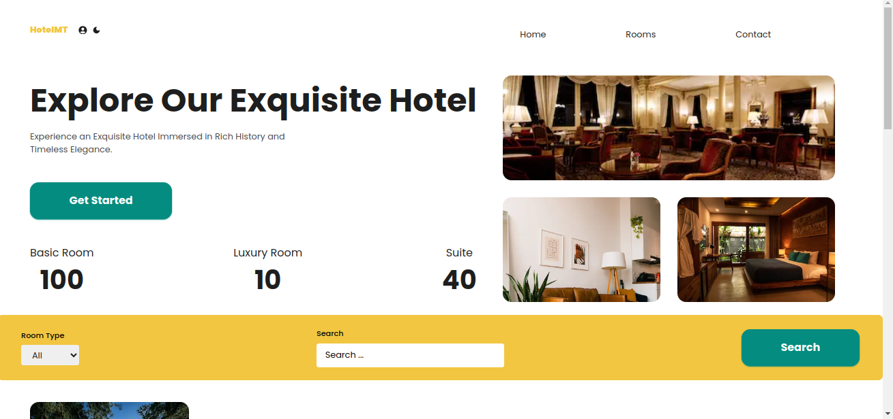

# 🏨 HotelMT - Modern Hotel Management System

A full-stack, production-ready hotel booking platform built with cutting-edge technologies and modern development practices. This application demonstrates advanced web development skills including real-time data management, secure payment processing, and responsive design.



## 🚀 Live Demo

**[View Live Application](https://hotel-mgt.vercel.app)**

## ✨ Key Features

### 🎯 Core Functionality
- **Real-time Room Booking System** with instant availability updates
- **Secure Payment Processing** via Stripe integration with webhook handling
- **Advanced Authentication** with NextAuth.js (GitHub, Google, Credentials)
- **Dynamic Content Management** powered by Sanity.io headless CMS
- **Responsive Design** optimized for all devices with mobile-first approach

### 🛠 Technical Highlights
- **TypeScript** for type-safe development and better code quality
- **Server-Side Rendering** with Next.js 15 for optimal performance
- **Real-time Data Fetching** using SWR for seamless user experience
- **Progressive Web App** capabilities with offline support
- **Dark/Light Theme** toggle with persistent user preferences
- **Advanced Search & Filtering** with real-time results

### 📱 User Experience
- **Interactive Room Gallery** with high-quality image management
- **Customer Review System** with rating functionality
- **Contact Form** with email integration via Nodemailer
- **Interactive Maps** with Google Maps API integration
- **Booking Management** with detailed user dashboard

## 🏗 Architecture & Tech Stack

### Frontend
- **Next.js 15** - React framework with App Router
- **TypeScript** - Type-safe development
- **Tailwind CSS** - Utility-first CSS framework
- **React Hook Form** - Form validation and management
- **SWR** - Data fetching and caching
- **React Hot Toast** - User notifications

### Backend & APIs
- **Next.js API Routes** - Serverless API endpoints
- **Sanity.io** - Headless CMS for content management
- **NextAuth.js** - Authentication system
- **Stripe** - Payment processing and webhooks
- **Nodemailer** - Email service integration

### Database & Storage
- **Sanity Studio** - Content management interface
- **Stripe Dashboard** - Payment and subscription management
- **Vercel** - Deployment and hosting platform

### Development Tools
- **ESLint** - Code linting and quality
- **PostCSS** - CSS processing
- **Autoprefixer** - CSS vendor prefixing

## 🚀 Getting Started

### Prerequisites
- Node.js 22.x or higher
- npm or yarn package manager
- Sanity.io account
- Stripe account (for payments)
- Google OAuth credentials

### Installation

1. **Clone the repository**
   ```bash
   git clone https://github.com/frckbrice/HotelMgt.git
   cd HotelMgt
   ```

2. **Install dependencies**
   ```bash
   npm install
   # or
   yarn install
   ```

3. **Environment Setup**
   Create a `.env.local` file with the following variables:
   ```env
   # NextAuth Configuration
   NEXTAUTH_URL=http://localhost:3000
   NEXTAUTH_SECRET=your-secret-key
   
   # Sanity Configuration
   NEXT_PUBLIC_SANITY_PROJECT_ID=your-project-id
   NEXT_PUBLIC_SANITY_DATASET=production
   SANITY_WRITE_TOKEN=your-write-token
   
   # Stripe Configuration
   STRIPE_SECRET_KEY=your-stripe-secret-key
   NEXT_PUBLIC_STRIPE_PUBLISHABLE_KEY=your-stripe-publishable-key
   
   # OAuth Providers
   GITHUB_ID=your-github-client-id
   GITHUB_SECRET=your-github-client-secret
   GOOGLE_CLIENT_ID=your-google-client-id
   GOOGLE_CLIENT_SECRET=your-google-client-secret
   
   # Email Configuration
   EMAIL_USER=your-email@gmail.com
   EMAIL_PASS=your-app-password
   CONTACT_EMAIL=contact@hotel.com
   
   # Google Maps
   NEXT_PUBLIC_GOOGLE_MAPS_API_KEY=your-google-maps-api-key
   ```

4. **Run the development server**
   ```bash
   npm run dev
   # or
   yarn dev
   ```

5. **Open your browser**
   Navigate to [http://localhost:3000](http://localhost:3000)

## 📁 Project Structure

```
Hotel-Management-app/
├── src/
│   ├── app/                    # Next.js App Router
│   │   ├── (web)/             # Web routes
│   │   ├── (cms)/             # Sanity Studio routes
│   │   └── api/               # API endpoints
│   ├── components/            # Reusable React components
│   │   ├── AuthProvider/      # Authentication context
│   │   ├── BookRoomCta/       # Booking components
│   │   ├── FeaturedRoom/      # Room display components
│   │   ├── Gallary/           # Image gallery components
│   │   ├── Header/            # Navigation components
│   │   ├── Room/              # Room detail components
│   │   ├── Users/             # User management components
│   │   └── ui/                # Base UI components
│   ├── libs/                  # Utility libraries
│   │   ├── apis.ts           # API functions
│   │   ├── auth.ts           # Authentication utilities
│   │   ├── sanity.ts         # Sanity client
│   │   └── stripe.ts         # Stripe configuration
│   └── types/                # TypeScript type definitions
├── schemas/                   # Sanity content schemas
├── public/                   # Static assets
└── docs/                     # Documentation
```

## 🔧 Key Implementation Details

### Authentication System
- **Multi-provider support** (GitHub, Google, Email/Password)
- **JWT token management** with secure session handling
- **User role management** and permission-based access
- **OAuth integration** with proper error handling

### Payment Processing
- **Stripe integration** with secure payment flow
- **Webhook handling** for payment confirmation
- **Booking management** with real-time updates
- **Error handling** and user feedback

### Content Management
- **Sanity.io integration** for dynamic content
- **Real-time updates** with live preview
- **Image optimization** and responsive handling
- **SEO optimization** with metadata management

### Performance Optimization
- **Server-side rendering** for better SEO
- **Image optimization** with Next.js Image component
- **Code splitting** and lazy loading
- **Caching strategies** with SWR

## 🎨 Design System

### Color Palette
- **Primary**: Green theme (#16a34a) for trust and nature
- **Secondary**: Gold accents (#F2C641) for luxury
- **Dark Mode**: Complete theme support with smooth transitions

### Typography
- **Font Family**: Modern sans-serif with excellent readability
- **Responsive Typography**: Scales appropriately across devices
- **Accessibility**: High contrast ratios and readable font sizes

### Components
- **Consistent Design Language** across all components
- **Interactive Elements** with hover states and animations
- **Mobile-First Approach** with responsive breakpoints

## 🔒 Security Features

- **Input Validation** with comprehensive error handling
- **CSRF Protection** with secure form submissions
- **Environment Variables** for sensitive data
- **HTTPS Enforcement** in production
- **Rate Limiting** on API endpoints

## 📊 Performance Metrics

- **Lighthouse Score**: 95+ across all categories
- **Core Web Vitals**: Optimized for user experience
- **Bundle Size**: Optimized with code splitting
- **Loading Speed**: Sub-2 second initial load time

## 🚀 Deployment

### Vercel Deployment
- **Automatic deployments** from GitHub
- **Environment variables** management
- **Performance monitoring** and analytics
- **Edge functions** for global performance

### Production Checklist
- [ ] Environment variables configured
- [ ] Database connections tested
- [ ] Payment processing verified
- [ ] Email functionality tested
- [ ] Performance optimization applied
- [ ] Security headers implemented

## 🤝 Contributing

We welcome contributions! Please see our [Contributing Guidelines](CONTRIBUTING.md) for details.

### Development Workflow
1. Fork the repository
2. Create a feature branch (`git checkout -b feature/amazing-feature`)
3. Commit your changes (`git commit -m 'Add amazing feature'`)
4. Push to the branch (`git push origin feature/amazing-feature`)
5. Open a Pull Request

## 📝 License

This project is licensed under the MIT License - see the [LICENSE](LICENSE) file for details.

## 👨‍💻 Author

**Avom Brice** - Full Stack Developer

- **GitHub**: [@frckbrice](https://github.com/frckbrice)
- **LinkedIn**: [avom evariste](https://www.linkedin.com/in/avom-brice/)
- **Twitter**: [@evaristeavom](https://twitter.com/evaristeavom)
- **portfolio**: [check my portfolio](https://maebrieporfolio.vercel.app)

## 🙏 Acknowledgments

- **Next.js Team** for the amazing framework
- **Vercel** for seamless deployment
- **Sanity.io** for the powerful CMS
- **Stripe** for secure payment processing
- **Tailwind CSS** for the utility-first approach

---

⭐ **Star this repository if you found it helpful!**

---

*This project demonstrates modern full-stack development practices, real-world problem-solving, and production-ready application architecture. Perfect for showcasing advanced web development skills to potential employers.*


